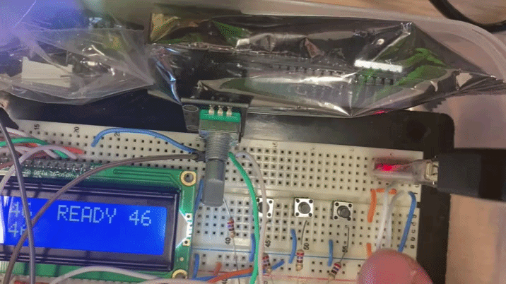
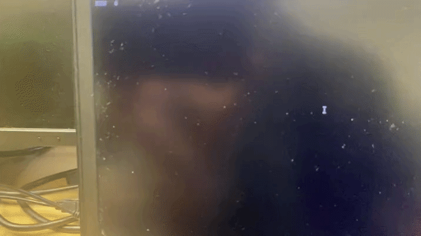

# STM32 LCD & UART Staircase Controller

An embedded systems project built for an STM32VL Discovery board (ARM Cortex-M3) featuring a 2x16 character LCD (HD44780 controller) interfaced via shift registers, an incremental rotary encoder with push-button integration, and an internal UART communication channel for terminal control and non-volatile flash storage.

### LCD Screen Display
*Real-time operational states and timer views on the 2x16 character display.*

### PC Terminal Control (UART)
*Remote monitoring and terminal user interface interaction.*

---

## Features & Functional Overview

- **HD44780 LCD Interface (2x16 Characters):** Driven using a serial-to-parallel shift register (74164) for data lines, while control signals (RS and E) are managed directly via GPIO outputs. Displays real-time operational states and timers (RUN, SET, READY).
- **Multi-Modal Input Interface:** 
  - Three tactile external buttons for parameter adjustment (Increment, Decrement, Confirm, with simultaneous press resetting to 10 seconds).
  - Incremental rotary encoder for smooth time adjustment, with an integrated push-button acting as the Confirm command.
- **UART Serial Terminal Control:** Remote monitoring and parameter configuration through a terminal interface (supporting characters for adjustment, confirmation, and start triggers).
- **Non-Volatile Flash Storage:** Confirmed timer settings are written directly to designated flash memory addresses on the STM32F100 MCU.
- **Bare-Metal Implementation:** Developed in Keil uVision using C without heavy hardware abstraction layer (HAL) frameworks.

---

## Hardware Architecture & Components

- **Microcontroller:** STM32F100RB (STM32VL Discovery evaluation board).
- **Display:** 2x16 character LCD with an HD44780 controller.
- **Shift Register:** 74164 serial-in parallel-out shift register for LCD data transmission.
- **User Inputs:** Incremental rotary encoder and tactile push-buttons.
- **Communication:** UART-to-USB converter interface (such as CH340G) for serial terminal linking.

---

## Project Structure

- `Source/` — Main C source files and application logic.
- `Libraries/` — Low-level device drivers and peripheral support.
- `demo.uvproj` — Keil uVision project file.
- `demo.uvopt` — Keil target options and debug configuration.
